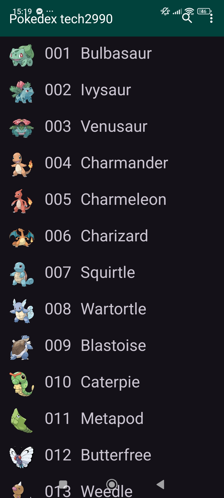
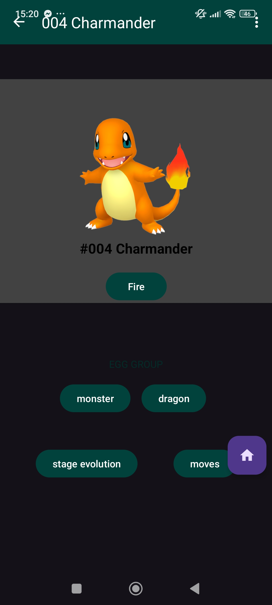

# 📱 Dex App - Pokémon Explorer

🌎 Read this in: **Português** | [English](README.en.md)

Enciclopédia Pokémon desenvolvida em **Kotlin**, focada em demonstrar a implementação da arquitetura **MVVM** e o consumo eficiente de APIs REST utilizando a **PokéAPI**.

---

## 🚀 O Projeto

O Dex App é um guia detalhado que permite aos usuários explorar o universo Pokémon. O projeto foi construído para ser um exemplo prático de como estruturar uma aplicação escalável, utilizando componentes do **Android Jetpack** e garantindo uma separação clara de responsabilidades.

## 🏗️ Arquitetura e Estrutura

Para garantir a manutenibilidade e testabilidade, o projeto utiliza o padrão **MVVM (Model-View-ViewModel)**:
- **View:** Camada de interface (Activities/Fragments) que observa as mudanças no ViewModel.
- **ViewModel:** Gerencia os dados relacionados à UI e sobrevive a mudanças de configuração, comunicando-se com a camada de dados.
- **Model (Data):** Responsável pelo consumo da API e gerenciamento das regras de negócio.

## 🛠️ Tecnologias e Bibliotecas

O ecossistema do projeto foi construído com ferramentas consolidadas no mercado:

- **Rede & API:** - [Retrofit](https://square.github.io/retrofit/): Interface para consumo da PokéAPI.
  - [OkHttp](https://square.github.io/okhttp/): Interceptors e gerenciamento eficiente de requisições HTTP.
- **Processamento de Imagens:** - [Fresco](https://frescolib.org/) & [Picasso](https://square.github.io/picasso/): Carregamento inteligente e cache de imagens para otimização de memória.
- **Android Jetpack:**
  - **ViewModel & LiveData:** Para uma UI reativa e ciclo de vida seguro.
  - **View Binding:** Acesso seguro e performático aos componentes de layout.

## 📈 Melhores Práticas Implementadas

- **Separação de Responsabilidades:** Código organizado para facilitar futuras implementações e correções.
- **Manipulação Assíncrona:** Gerenciamento de chamadas de rede para garantir que a UI nunca trave.
- **Gerenciamento de Cache:** Uso de bibliotecas de imagem para reduzir o consumo de dados e melhorar a experiência do usuário.

## 📸 Demonstração

| Listagem | Detalhes Técnicos |
| :---: | :---: |
|  |  |

## 🔗 Links Úteis

| 📂 Repositório Principal |
| :--- |
|  |

---

## 📥 Download do App

> **Dica:** Se o download não iniciar, verifique se a versão v1.0.0 foi publicada como "Latest" no GitHub.

---

## 👨‍💻 Desenvolvido por

**Douglas Sousa de Oliveira**

